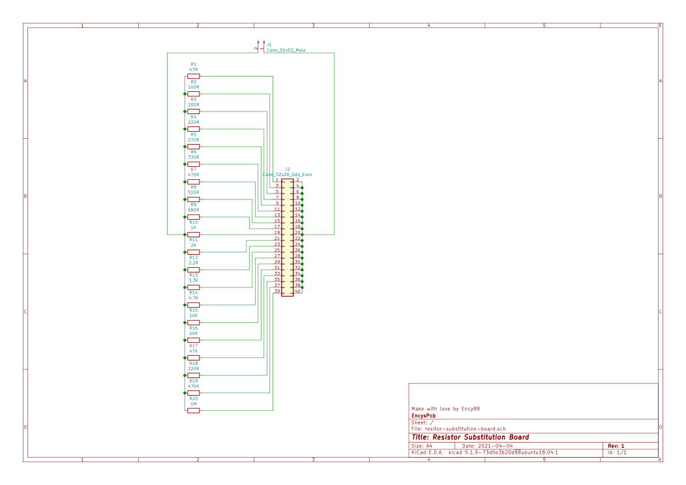
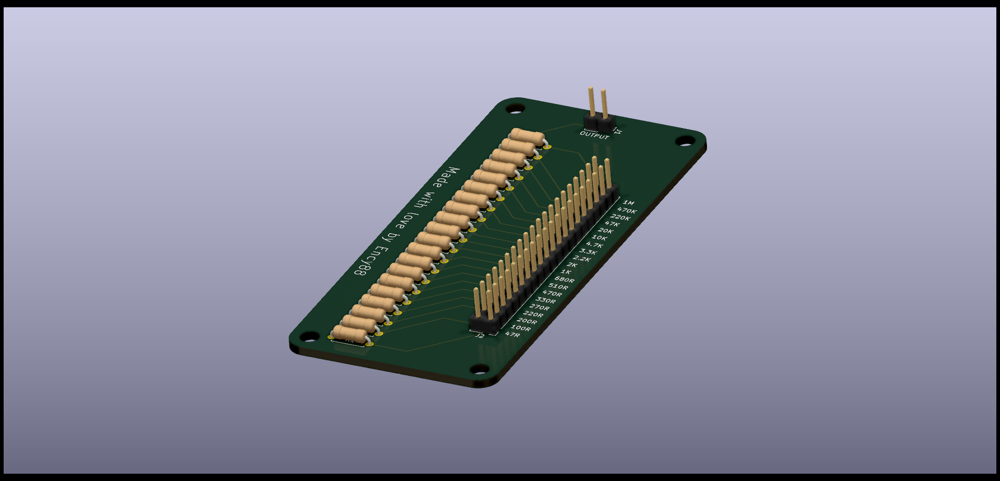

# KiCad - Resistor Substitution Board

This repo contains all necessary files to get and change Resistor Substitution Board in KiCad.

Project contains schematic & pcb design

### Schematic

### 3D View
